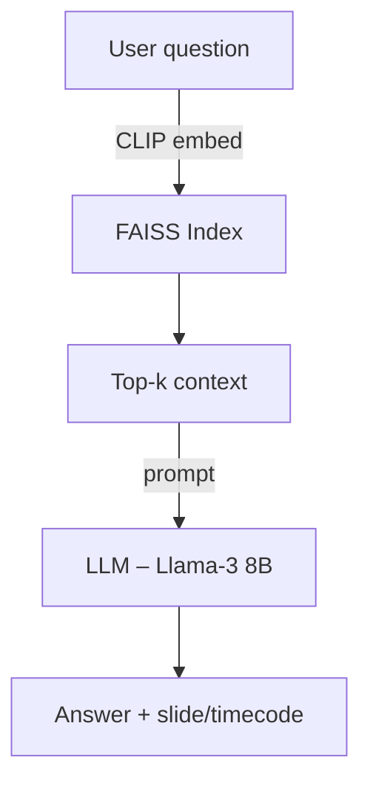

# Multimodal RAG – Image + Text Search

Retrieval‑Augmented Generation pipeline that lets you ask questions like:

> *“Find me the slide where Geoffrey Hinton explains back‑propagation.”*

on **PDF decks** or **YouTube videos**. Everything runs *locally* – no paid APIs.

---
## Quick start

```bash
git clone https://github.com/your-user/multimodal-rag.git
cd multimodal-rag
conda env create -f environment.yml
conda activate multimodal-rag
python post_install.py           # installs the best PyTorch build
streamlit run app.py             # launch the UI on http://localhost:8501
```

---
## Directory structure

```
multimodal-rag/
├── environment.yml
├── post_install.py
├── README.md
├── app.py
└── src/
    ├── ingest_pdf.py
    ├── ingest_video.py
    ├── embed.py
    ├── vector_store.py
    ├── retrieve.py
    ├── generate.py
    └── utils/
        ├── device.py
        └── __init__.py
```

---
## Architecture (Mermaid)



---
## Future work

- **Automated RAG evaluation** with RAGAS (local Mixtral or API).
- Docker image for GPU deployment.

---
## License

MIT
---
## src/utils/device.py
```python
"""Utility to pick the best available torch.device."""
import torch

def get_device(prefer_gpu: bool = True) -> torch.device:
    if prefer_gpu and torch.cuda.is_available():
        return torch.device("cuda")
    if prefer_gpu and torch.backends.mps.is_available():
        return torch.device("mps")
    return torch.device("cpu")
```